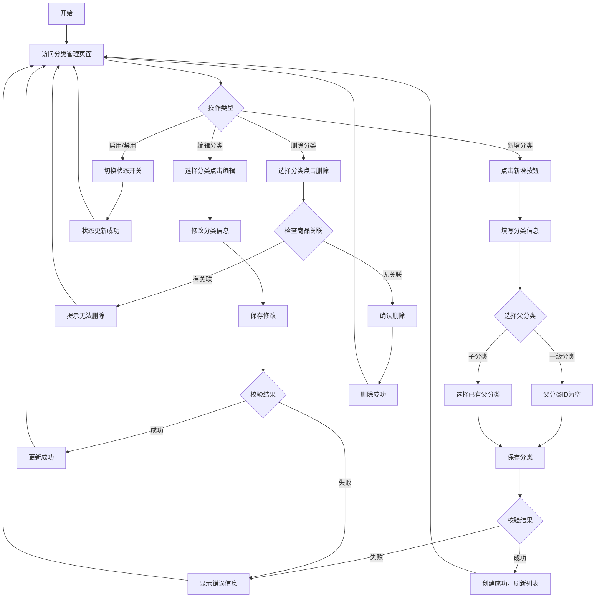
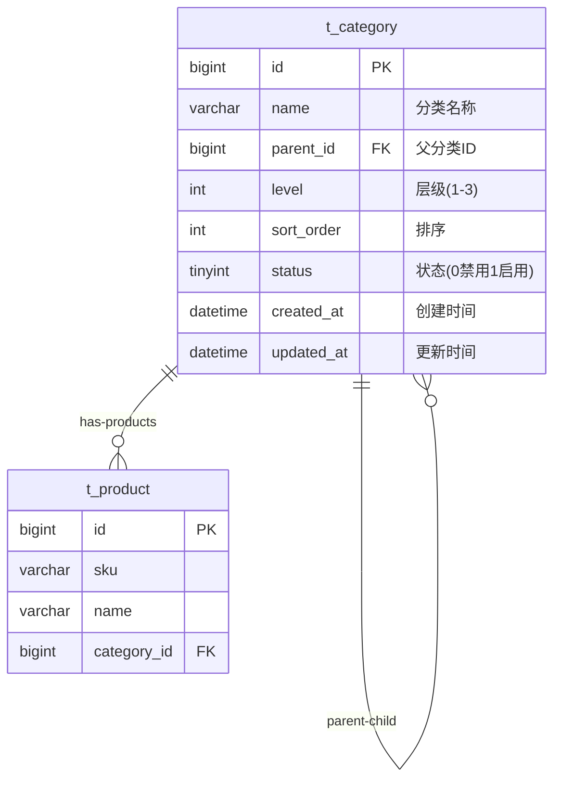

# Feature Spec: 商品分类管理 (Category Management)

> **版本**: 1.0
> **创建日期**: 2026-01-04
> **作者**: Claude Code
> **状态**: Draft

## Overview

商品分类管理模块是进销存系统的基础功能模块，用于管理商品的分类层级结构，实现商品的分类组织和高效检索。

### Problem Statement

当前系统中商品管理需要分类功能，但缺少独立的分类管理模块。存在的问题：
- 商品必须关联分类，但分类无法独立管理
- 无法创建和维护分类层级结构
- 分类信息分散，不便于统一管理
- 缺少分类的启用/禁用控制

### Proposed Solution

实现一个独立的商品分类管理模块，提供：
- 分类的增删改查操作
- 支持多级分类层级（最多3级）
- 分类的启用/禁用状态管理
- 分类与商品的关联管理
- 分类数据的导入/导出功能

## User Stories

### Story 1: 分类管理员管理分类结构

```
As a 分类管理员,
I want to 创建和管理商品分类层级,
So that 可以对商品进行有效的分类组织。
```

**Priority**: High
**Estimate**: 5

#### Acceptance Criteria

- [ ] 可以创建一级分类（父分类ID为空）
- [ ] 可以创建二级和三级分类（指定父分类ID）
- [ ] 不支持超过3级的分类层级
- [ ] 分类名称在同级分类中唯一
- [ ] 可以编辑分类的基本信息
- [ ] 可以删除无关联商品的分类

### Story 2: 商品关联分类

```
As a 商品管理员,
I want to 在创建/编辑商品时选择分类,
So that 商品可以归属到正确的分类下。
```

**Priority**: High
**Estimate**: 3

#### Acceptance Criteria

- [ ] 商品表单中显示分类树形选择器
- [ ] 只显示启用状态的分类供选择
- [ ] 保存商品时校验分类的有效性
- [ ] 商品列表显示分类名称

### Story 3: 分类状态控制

```
As a 系统管理员,
I want to 启用或禁用商品分类,
So that 可以控制哪些分类可用于新商品。
```

**Priority**: Medium
**Estimate**: 2

#### Acceptance Criteria

- [ ] 可以切换分类的启用/禁用状态
- [ ] 禁用的分类不能用于新商品
- [ ] 已关联商品的分类禁用时，商品仍保留该分类
- [ ] 禁用分类在列表中有视觉标识

### Story 4: 分类数据导入导出

```
As a 数据管理员,
I want to 批量导入和导出分类数据,
So that 可以快速初始化或备份分类数据。
```

**Priority**: Low
**Estimate**: 3

#### Acceptance Criteria

- [ ] 支持Excel模板导入分类数据
- [ ] 导入时验证数据格式和业务规则
- [ ] 提供导入结果报告（成功/失败数量）
- [ ] 支持导出所有分类数据为Excel

## Requirements

### Functional Requirements

| ID | Requirement | Priority | Status |
|----|-------------|----------|--------|
| FR-001 | 系统支持创建最多3级的分类层级结构 | Must | - |
| FR-002 | 分类名称在同一父分类下必须唯一 | Must | - |
| FR-003 | 可以删除无关联商品的分类 | Must | - |
| FR-004 | 有商品关联的分类不能删除（需先解除关联） | Must | - |
| FR-005 | 分类支持启用/禁用状态 | Should | - |
| FR-006 | 禁用的分类不显示在商品表单的分类选择器中 | Should | - |
| FR-007 | 支持批量导入分类数据 | Could | - |
| FR-008 | 支持导出分类数据为Excel | Could | - |

### Non-Functional Requirements

| Category | Requirement | Metric |
|----------|-------------|--------|
| Performance | 分类列表查询响应时间 | < 200ms (1000条记录) |
| Performance | 分类树形结构加载时间 | < 500ms |
| Security | 分类管理操作需要登录 | 所有操作需认证 |
| Reliability | 删除分类时检查商品关联 | 100% 校验率 |
| Usability | 支持分类名称的模糊搜索 | 响应时间 < 300ms |

## Scope

### In Scope

- 分类的基础 CRUD 操作
- 多级分类层级管理（最多3级）
- 分类的启用/禁用状态管理
- 分类与商品的关联关系维护
- 分类的批量导入/导出
- 分类列表的树形展示
- 分类的模糊搜索功能

### Out of Scope

- 分类权限的细分管理（Reason：当前版本使用简单的登录认证）
- 分类的历史版本管理（Reason：非核心需求，后续版本考虑）
- 分类的多语言支持（Reason：当前版本仅支持中文）
- 自定义分类属性（Reason：当前版本使用固定属性结构）

## User Flow



### Step by Step

1. **创建分类**
   - 触发条件: 用户点击"新增分类"按钮
   - 用户操作: 填写分类名称、排序、选择父分类（可选）
   - 系统响应: 校验名称唯一性、层级深度，保存成功后刷新列表

2. **编辑分类**
   - 触发条件: 用户点击某分类的"编辑"按钮
   - 用户操作: 修改分类信息（名称、排序、状态等）
   - 系统响应: 校验数据有效性，更新成功后刷新列表

3. **删除分类**
   - 触发条件: 用户点击某分类的"删除"按钮
   - 用户操作: 确认删除操作
   - 系统响应: 检查是否有商品关联，无关联则删除，有关联则提示错误

4. **切换状态**
   - 触发条件: 用户点击分类的状态开关
   - 用户操作: 切换启用/禁用状态
   - 系统响应: 更新状态，刷新列表

## UI/UX Requirements

### Screens

| Screen | Description | Mockup Link |
|--------|-------------|-------------|
| CategoryList | 分类列表页（树形表格展示） | 待设计 |
| CategoryForm | 分类新增/编辑表单 | 待设计 |
| CategoryImport | 分类批量导入页 | 待设计 |

### Interactions

| Element | Interaction | Behavior |
|---------|-------------|----------|
| 分类列表 | 树形展开/折叠 | 点击展开图标显示子分类 |
| 新增按钮 | 打开表单对话框 | 显示分类表单，父分类为可选 |
| 编辑按钮 | 打开表单对话框 | 显示分类表单，预填充当前数据 |
| 删除按钮 | 二次确认 | 弹出确认对话框，确认后执行删除 |
| 状态开关 | 即时切换 | 点击切换状态，无需确认 |
| 搜索框 | 实时搜索 | 输入后300ms触发搜索，高亮匹配结果 |

## Data Model

### Entities



### Data Fields

#### t_category (商品分类表)

| Field | Type | Required | Constraints | Description |
|-------|------|----------|-------------|-------------|
| id | BIGINT | Yes | Primary Key, Auto Increment | 分类ID |
| name | VARCHAR(50) | Yes | Length <= 50 | 分类名称 |
| parent_id | BIGINT | No | FK -> t_category.id, NULL for root | 父分类ID |
| level | TINYINT | Yes | Range: 1-3 | 分类层级 |
| sort_order | INT | Yes | Default: 0 | 排序号（越小越靠前） |
| status | TINYINT | Yes | Default: 1, Range: 0-1 | 状态：0-禁用，1-启用 |
| created_at | DATETIME | Yes | Default: CURRENT_TIMESTAMP | 创建时间 |
| updated_at | DATETIME | Yes | Default: CURRENT_TIMESTAMP ON UPDATE | 更新时间 |

#### t_product (商品表 - 关联字段)

| Field | Type | Required | Constraints | Description |
|-------|------|----------|-------------|-------------|
| category_id | BIGINT | Yes | FK -> t_category.id | 商品分类ID |

### Indexes

| Index | Fields | Type | Description |
|-------|--------|------|-------------|
| idx_parent_id | parent_id | Normal | 快速查询父分类的子分类 |
| idx_level | level | Normal | 按层级查询分类 |
| idx_status | status | Normal | 查询启用状态的分类 |
| uk_name_parent | name, parent_id | Unique | 同级分类名称唯一 |

## API Requirements

### Endpoints

| Method | Endpoint | Description | Auth Required |
|--------|----------|-------------|---------------|
| POST | /api/categories | 创建分类 | Yes |
| PUT | /api/categories/{id} | 更新分类 | Yes |
| DELETE | /api/categories/{id} | 删除分类 | Yes |
| GET | /api/categories/{id} | 获取分类详情 | Yes |
| GET | /api/categories | 获取分类列表（树形） | Yes |
| GET | /api/categories/tree | 获取分类树（用于选择器） | Yes |
| PATCH | /api/categories/{id}/status | 切换分类状态 | Yes |
| POST | /api/categories/import | 批量导入分类 | Yes |
| GET | /api/categories/export | 导出分类数据 | Yes |

### 详细 API 规范

#### POST /api/categories - 创建分类

**Request Body:**
```json
{
  "name": "电子产品",
  "parentId": null,
  "level": 1,
  "sortOrder": 1
}
```

**Response:**
```json
{
  "code": 200,
  "message": "创建成功",
  "data": {
    "id": 1,
    "name": "电子产品",
    "parentId": null,
    "level": 1,
    "sortOrder": 1,
    "status": 1,
    "createdAt": "2026-01-04T10:00:00"
  }
}
```

**Error Responses:**
- `400`: 分类名称重复
- `400`: 分类层级超过限制
- `400`: 父分类不存在

#### GET /api/categories - 获取分类列表

**Query Parameters:**
- `name` (optional): 分类名称（模糊搜索）
- `status` (optional): 状态过滤（0/1）
- `level` (optional): 层级过滤（1/2/3）

**Response:**
```json
{
  "code": 200,
  "message": "success",
  "data": [
    {
      "id": 1,
      "name": "电子产品",
      "parentId": null,
      "level": 1,
      "sortOrder": 1,
      "status": 1,
      "children": [
        {
          "id": 2,
          "name": "手机",
          "parentId": 1,
          "level": 2,
          "sortOrder": 1,
          "status": 1,
          "children": []
        }
      ]
    }
  ]
}
```

#### DELETE /api/categories/{id} - 删除分类

**Response (Success):**
```json
{
  "code": 200,
  "message": "删除成功"
}
```

**Error Responses:**
- `400`: 分类存在关联商品，无法删除
- `404`: 分类不存在
- `400`: 分类存在子分类，无法删除

> 详细 API 规范请参考: `.claude/specs/api/category-api.md`（待创建）

## Dependencies

| Dependency | Type | Status | Notes |
|------------|------|--------|-------|
| 商品管理模块 | Internal | 已存在 | 商品表已有 category_id 字段 |
| 数据库 MySQL | External | 需创建 | 需创建 t_category 表 |
| 认证模块 | Internal | 待实现 | 用户登录认证 |

## Implementation Plan

### Phases

#### Phase 1: 数据库与后端 API

**Goal**: 完成分类管理的数据存储和 API 接口

| Task | Estimate | Owner | Status |
|------|----------|-------|--------|
| 创建 t_category 数据表 | 1h | Backend | - |
| 实现 CategoryEntity 实体类 | 0.5h | Backend | - |
| 实现 CategoryMapper 数据访问层 | 0.5h | Backend | - |
| 实现 CategoryService 服务层 | 2h | Backend | - |
| 实现 CategoryController 控制器 | 1.5h | Backend | - |
| 编写单元测试 | 2h | Backend | - |
| 集成 Knife4j API 文档 | 0.5h | Backend | - |

#### Phase 2: 前端页面

**Goal**: 完成分类管理的用户界面

| Task | Estimate | Owner | Status |
|------|----------|-------|--------|
| 创建 Category API 接口文件 | 0.5h | Frontend | - |
| 实现分类列表页面（树形表格） | 3h | Frontend | - |
| 实现分类表单组件 | 2h | Frontend | - |
| 实现分类状态切换功能 | 1h | Frontend | - |
| 实现分类搜索功能 | 1h | Frontend | - |
| 配置路由和菜单 | 0.5h | Frontend | - |

#### Phase 3: 商品模块集成

**Goal**: 将分类管理集成到商品管理模块

| Task | Estimate | Owner | Status |
|------|----------|-------|--------|
| 修改商品表单，添加分类树选择器 | 2h | Frontend | - |
| 更新商品 API 的分类校验逻辑 | 1h | Backend | - |
| 商品列表显示分类信息 | 0.5h | Frontend | - |

#### Phase 4: 批量导入导出

**Goal**: 实现分类数据的批量操作

| Task | Estimate | Owner | Status |
|------|----------|-------|--------|
| 实现分类数据导入功能 | 3h | Backend | - |
| 实现分类数据导出功能 | 2h | Backend | - |
| 实现前端导入导出界面 | 2h | Frontend | - |

## Testing Strategy

### Test Types

- [x] Unit Tests
- [x] Integration Tests
- [ ] E2E Tests
- [ ] Performance Tests
- [ ] Security Tests

### Test Cases

| ID | Scenario | Expected Result | Status |
|----|----------|-----------------|--------|
| TC-001 | 创建一级分类 | 成功创建，parent_id 为 null，level 为 1 | - |
| TC-002 | 创建二级分类 | 成功创建，parent_id 指向父分类，level 为 2 | - |
| TC-003 | 创建三级分类 | 成功创建，level 为 3 | - |
| TC-004 | 尝试创建四级分类 | 返回错误，提示层级超过限制 | - |
| TC-005 | 同级创建重复名称分类 | 返回错误，提示名称已存在 | - |
| TC-006 | 不同级创建同名分类 | 成功创建 | - |
| TC-007 | 删除无商品关联的分类 | 成功删除 | - |
| TC-008 | 删除有商品关联的分类 | 返回错误，提示存在关联商品 | - |
| TC-009 | 删除有子分类的分类 | 返回错误，提示存在子分类 | - |
| TC-010 | 禁用分类 | status 更新为 0 | - |
| TC-011 | 获取分类树 | 返回嵌套的树形结构 | - |
| TC-012 | 搜索分类名称 | 返回名称匹配的分类及其子分类 | - |
| TC-013 | 批量导入分类数据 | 成功导入，返回成功/失败统计 | - |
| TC-014 | 导出分类数据 | 生成 Excel 文件，包含所有分类 | - |

## Business Rules

### 1. 分类层级限制
```
规则：分类最多支持3级
校验：创建分类时，如果父分类是3级，则不允许创建
处理：返回错误提示"分类层级不能超过3级"
```

### 2. 分类名称唯一性
```
规则：同一父分类下的分类名称必须唯一
校验：创建/编辑分类时，检查同级分类中是否存在相同名称
处理：返回错误提示"分类名称已存在"
```

### 3. 分类删除约束
```
规则：有关联商品或有子分类的分类不能删除
校验：删除前检查商品关联表和子分类
处理：
  - 有商品关联：提示"该分类下有商品，无法删除"
  - 有子分类：提示"该分类下有子分类，请先删除子分类"
```

### 4. 分类状态与商品关联
```
规则：禁用的分类不能用于新商品，但不影响已有商品
校验：商品保存时检查分类状态
处理：
  - 分类被禁用：商品表单中不显示该分类
  - 已有商品的分类被禁用：商品保留该分类关联
```

### 5. 分类排序
```
规则：同级分类按 sort_order 升序排列
显示：列表和树形选择器中都按排序规则展示
处理：sort_order 默认为 0，用户可自定义
```

## Risks & Mitigations

| Risk | Probability | Impact | Mitigation Strategy |
|------|-------------|--------|---------------------|
| 分类层级过深导致查询性能问题 | Low | Medium | 限制最多3级，添加数据库索引优化查询 |
| 大量分类数据导致前端渲染卡顿 | Medium | Medium | 实现虚拟滚动或分页加载 |
| 分类删除导致商品数据异常 | Low | High | 强制外键约束，删除前严格校验 |
| 并发创建导致重复分类 | Low | Medium | 数据库唯一索引约束 + 事务处理 |
| 批量导入数据格式错误 | Medium | Low | 提供标准模板，导入前数据校验 |

## Success Metrics

| Metric | Target | How to Measure |
|--------|--------|----------------|
| 分类创建成功率 | > 99% | 监控 API 创建成功/失败比例 |
| 分类列表加载时间 | < 500ms | 前端性能监控 |
| 分类搜索响应时间 | < 300ms | API 响应时间监控 |
| 批量导入成功率 | > 95% | 导入任务成功/失败统计 |
| 用户满意度 | > 4.0/5.0 | 用户反馈问卷 |

## Rollout Plan

### Stages

1. **Alpha** (1周): 内部测试，完成基本功能开发和测试
2. **Beta** (1周): 小范围试用，收集用户反馈并优化
3. **GA** (正式发布): 全量发布，所有用户可用

### Feature Flags

| Flag | Description | Default |
|------|-------------|---------|
| `category.import.enabled` | 是否启用分类导入功能 | true |
| `category.export.enabled` | 是否启用分类导出功能 | true |
| `category.tree.lazy` | 是否懒加载分类树（性能优化） | false |

## Monitoring & Alerting

### Metrics to Track

- 分类总数（按层级统计）
- 分类创建/删除操作频率
- 分类 API 平均响应时间
- 分类导入/导出任务统计
- 错误率（4xx/5xx比例）

### Alert Conditions

| Condition | Severity | Action |
|-----------|----------|--------|
| 分类 API 错误率 > 5% | Warning | 检查日志，排查问题 |
| 分类 API 响应时间 > 1s | Warning | 检查数据库性能，优化查询 |
| 分类删除失败率 > 1% | Critical | 检查数据完整性，修复异常数据 |

## Database Migration Script

```sql
-- 创建商品分类表
CREATE TABLE t_category (
    id BIGINT PRIMARY KEY AUTO_INCREMENT COMMENT '分类ID',
    name VARCHAR(50) NOT NULL COMMENT '分类名称',
    parent_id BIGINT DEFAULT NULL COMMENT '父分类ID',
    level TINYINT NOT NULL DEFAULT 1 COMMENT '层级(1-3)',
    sort_order INT NOT NULL DEFAULT 0 COMMENT '排序号',
    status TINYINT NOT NULL DEFAULT 1 COMMENT '状态：0-禁用，1-启用',
    created_at DATETIME NOT NULL DEFAULT CURRENT_TIMESTAMP COMMENT '创建时间',
    updated_at DATETIME NOT NULL DEFAULT CURRENT_TIMESTAMP ON UPDATE CURRENT_TIMESTAMP COMMENT '更新时间',

    CONSTRAINT fk_category_parent FOREIGN KEY (parent_id)
        REFERENCES t_category(id) ON DELETE CASCADE,
    CONSTRAINT uk_category_name_parent UNIQUE (name, parent_id)
) ENGINE=InnoDB DEFAULT CHARSET=utf8mb4 COMMENT='商品分类表';

-- 创建索引
CREATE INDEX idx_category_parent ON t_category(parent_id);
CREATE INDEX idx_category_level ON t_category(level);
CREATE INDEX idx_category_status ON t_category(status);

-- 初始化默认分类数据
INSERT INTO t_category (name, parent_id, level, sort_order, status) VALUES
('电子产品', NULL, 1, 1, 1),
('食品饮料', NULL, 1, 2, 1),
('服装鞋帽', NULL, 1, 3, 1);

-- 创建电子产品子分类
INSERT INTO t_category (name, parent_id, level, sort_order, status) VALUES
('手机', 1, 2, 1, 1),
('电脑', 1, 2, 2, 1),
('配件', 1, 2, 3, 1);
```

## Changelog

| Version | Date | Changes | Author |
|---------|------|---------|--------|
| 1.0 | 2026-01-04 | 初始版本 | Claude Code |
