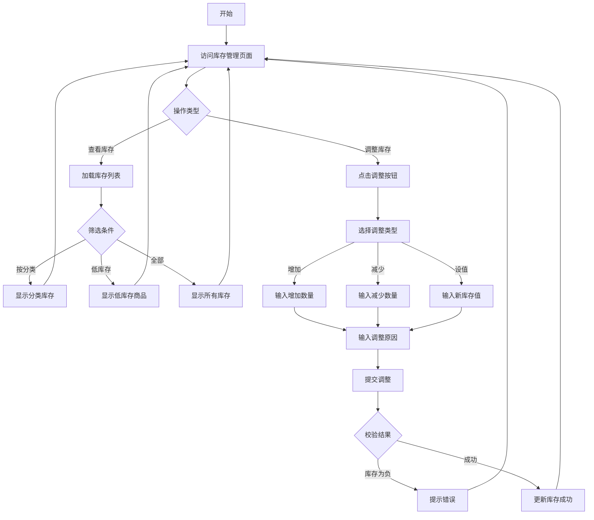
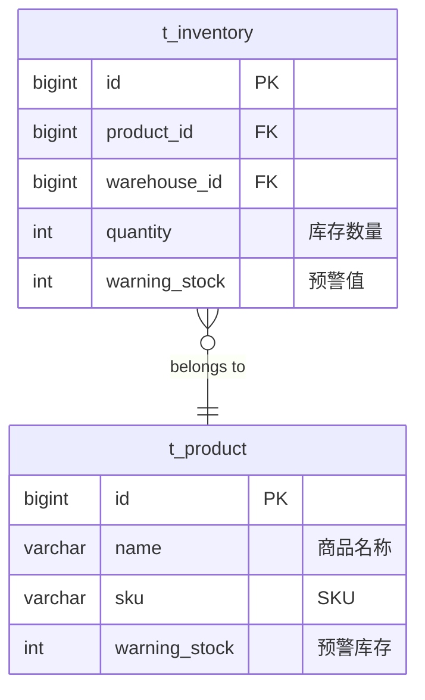

# Feature Spec: 库存管理 (Inventory Management)

> **版本**: 1.0
> **创建日期**: 2026-01-04
> **作者**: Claude Code
> **状态**: Draft

## Overview

库存管理模块是进销存系统的核心模块，用于管理商品的库存信息，包括库存查询、库存调整、库存预警等功能。

### Problem Statement

商品创建后需要管理其库存信息。库存管理需要支持：
- 实时查看商品库存
- 手动调整库存数量
- 库存不足时的预警提示
- 查看库存变化历史

### Proposed Solution

实现一个完整的库存管理模块，提供：
- 库存列表查询（支持筛选和分页）
- 库存手动调整（增加/减少/设值）
- 低库存预警提示
- 库存不足校验（供出入库使用）
- 库存汇总统计

## User Stories

### Story 1: 库管员查看库存

```
As a 库管员,
I want to 查看所有商品的库存信息,
So that 可以了解当前的库存状况。
```

**Priority**: High
**Estimate**: 3

#### Acceptance Criteria

- [ ] 可以查看库存列表（显示商品、分类、数量、预警值）
- [ ] 支持按商品名称/SKU搜索
- [ ] 支持按分类筛选
- [ ] 支持筛选低库存商品
- [ ] 支持分页查询

### Story 2: 库管员调整库存

```
As a 库管员,
I want to 手动调整商品库存,
So that 可以处理盘点差异或损耗。
```

**Priority**: High
**Estimate**: 3

#### Acceptance Criteria

- [ ] 可以增加库存（输入正数）
- [ ] 可以减少库存（输入负数）
- [ ] 可以直接设置库存值
- [ ] 调整时需要输入调整原因
- [ ] 调整后库存不能为负数
- [ ] 记录调整历史

### Story 3: 系统预警低库存

```
As a 库管员,
I want to 系统自动提示低库存商品,
So that 可以及时补货避免缺货。
```

**Priority**: High
**Estimate**: 2

#### Acceptance Criteria

- [ ] 库存 <= 预警值时在列表中高亮显示
- [ ] 可以单独查看低库存商品列表
- [ ] 低库存商品数量统计

### Story 4: 库存不足校验

```
As a 系统,
I want to 出库时检查库存是否充足,
So that 避免超卖情况。
```

**Priority**: High
**Estimate**: 2

#### Acceptance Criteria

- [ ] 出库前检查库存是否充足
- [ ] 库存不足时返回明确错误提示
- [ ] 显示当前库存和需要数量的差额

## Requirements

### Functional Requirements

| ID | Requirement | Priority | Status |
|----|-------------|----------|--------|
| FR-001 | 库存数量必须 >= 0 | Must | - |
| FR-002 | 调整库存时需要记录原因 | Should | - |
| FR-003 | 库存低于预警值时触发预警 | Should | - |
| FR-004 | 出库前必须检查库存充足 | Must | - |
| FR-005 | 支持批量调整库存 | Could | - |
| FR-006 | 支持查询库存变化历史 | Could | - |
| FR-007 | 支持按仓库筛选库存 | Could | - |

### Non-Functional Requirements

| Category | Requirement | Metric |
|----------|-------------|--------|
| Performance | 库存列表查询响应时间 | < 300ms (1000条记录) |
| Performance | 库存调整响应时间 | < 200ms |
| Security | 库存调整需要认证 | 所有操作需认证 |
| Reliability | 库存数据一致性保证 | 100% 准确 |
| Usability | 低库存商品醒目标识 | 颜色/图标区分 |

## Scope

### In Scope

- 库存列表查询（带筛选和分页）
- 库存手动调整（增加/减少/设值）
- 低库存预警提示
- 库存不足校验
- 库存汇总统计
- 按分类/仓库筛选

### Out of Scope

- 库存变动历史记录（Reason：后续版本考虑）
- 多仓库调拨（Reason：当前版本简化处理）
- 库存盘点功能（Reason：由独立的盘点模块处理）
- 库存预警通知（Reason：后续版本考虑）

## User Flow



## UI/UX Requirements

### Screens

| Screen | Description | Mockup Link |
|--------|-------------|-------------|
| InventoryList | 库存列表页（表格+筛选） | 待设计 |
| StockAdjustDialog | 库存调整对话框 | 待设计 |

### Interactions

| Element | Interaction | Behavior |
|---------|-------------|----------|
| 库存列表 | 低库存标识 | 红色高亮显示 |
| 调整按钮 | 打开对话框 | 显示调整表单 |
| 数量输入 | 正负数 | 正数=增加，负数=减少 |

## Data Model

### Entities

库存表已在商品模块中创建，这里补充说明：



## API Requirements

### Endpoints

| Method | Endpoint | Description | Auth Required |
|--------|----------|-------------|---------------|
| GET | /api/inventory | 获取库存列表（分页） | Yes |
| GET | /api/inventory/product/{productId} | 获取商品库存 | Yes |
| PUT | /api/inventory/{id}/adjust | 调整库存 | Yes |
| GET | /api/inventory/low-stock | 获取低库存列表 | Yes |
| POST | /api/inventory/check | 检查库存是否充足 | Yes |
| GET | /api/inventory/summary | 获取库存汇总 | Yes |

### 详细 API 规范

#### PUT /api/inventory/{id}/adjust - 调整库存

**Request Body:**
```json
{
  "type": "add",
  "quantity": 10,
  "reason": "盘点入库"
}
```

类型：`add`(增加), `reduce`(减少), `set`(设值)

**Response:**
```json
{
  "code": 200,
  "message": "库存调整成功",
  "data": {
    "oldQuantity": 50,
    "newQuantity": 60
  }
}
```

## Dependencies

| Dependency | Type | Status | Notes |
|------------|------|--------|-------|
| 商品管理模块 | Internal | 已完成 | 库存依赖商品信息 |
| 分类管理模块 | Internal | 已完成 | 按分类筛选 |

## Implementation Plan

### Phases

#### Phase 1: 后端基础功能

| Task | Estimate | Owner | Status |
|------|----------|-------|--------|
| 扩展 InventoryService | 1h | Backend | - |
| 实现 InventoryController | 1.5h | Backend | - |
| 实现库存汇总接口 | 0.5h | Backend | - |
| 编写单元测试 | 1h | Backend | - |

#### Phase 2: 前端页面

| Task | Estimate | Owner | Status |
|------|----------|-------|--------|
| 创建 Inventory API 接口 | 0.5h | Frontend | - |
| 实现库存列表页面 | 2h | Frontend | - |
| 实现库存调整对话框 | 1.5h | Frontend | - |
| 配置路由和菜单 | 0.5h | Frontend | - |

## Testing Strategy

### Test Cases

| ID | Scenario | Expected Result |
|----|----------|-----------------|
| TC-I001 | 查询库存列表 | 返回分页库存数据 |
| TC-I002 | 按分类筛选库存 | 返回该分类商品的库存 |
| TC-I003 | 查询低库存商品 | 返回库存<=预警值的商品 |
| TC-I004 | 增加库存 | 库存数量增加，返回新值 |
| TC-I005 | 减少库存（充足） | 库存数量减少，返回新值 |
| TC-I006 | 减少库存（不足） | 返回错误，库存不变 |
| TC-I007 | 设置库存值 | 库存更新为指定值 |
| TC-I008 | 检查库存充足 | 返回 true |
| TC-I009 | 检查库存不足 | 返回 false |
| TC-I010 | 调整库存为负数 | 返回错误 |

## Business Rules

### 1. 库存非负约束
```
规则：库存数量必须 >= 0
校验：调整库存时检查
处理：调整后为负则返回错误
```

### 2. 库存预警
```
规则：库存数量 <= 预警值时触发预警
显示：列表中红色高亮
筛选：可以单独查看低库存商品
```

### 3. 库存充足性检查
```
规则：出库前检查库存 >= 需求数量
校验：调用 checkStock 方法
处理：不足则返回明确错误
```

### 4. 调整原因
```
规则：手动调整库存必须记录原因
必填：调整原因字段
```

## Database Schema

库存表已在商品模块中创建，这里补充库存汇总查询：

```sql
-- 库存汇总查询（按分类）
SELECT
    c.name as category_name,
    COUNT(*) as product_count,
    SUM(i.quantity) as total_quantity,
    SUM(i.quantity * p.price) as total_amount
FROM t_inventory i
LEFT JOIN t_product p ON i.product_id = p.id
LEFT JOIN t_category c ON p.category_id = c.id
GROUP BY c.id
ORDER BY total_quantity DESC;
```

## Success Metrics

| Metric | Target | How to Measure |
|--------|--------|----------------|
| 库存查询响应时间 | < 300ms | API 性能监控 |
| 库存调整成功率 | > 99% | 监控调整成功/失败比例 |
| 低库存预警准确率 | 100% | 数据验证 |

## Changelog

| Version | Date | Changes | Author |
|---------|------|---------|--------|
| 1.0 | 2026-01-04 | 初始版本 | Claude Code |
