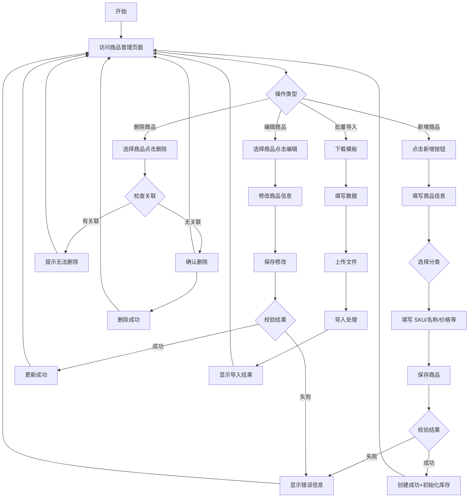
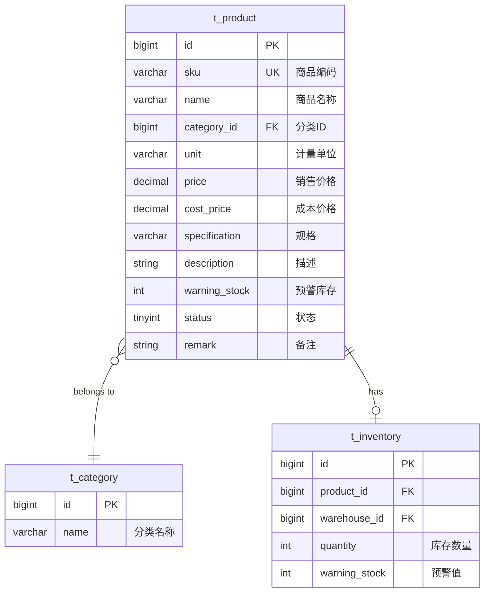

# Feature Spec: 商品管理 (Product Management)

> **版本**: 1.0
> **创建日期**: 2026-01-04
> **作者**: Claude Code
> **状态**: Draft

## Overview

商品管理模块是进销存系统的核心基础模块，用于管理商品的完整信息，包括商品基本信息、价格、库存预警等，并支持商品的批量导入导出功能。

### Problem Statement

当前系统缺少商品管理功能，无法进行商品的创建、编辑、删除等基础操作。商品是进销存系统的核心实体，其他模块（库存、入库、出库）都依赖于商品信息。

### Proposed Solution

实现一个完整的商品管理模块，提供：
- 商品的基本 CRUD 操作
- SKU 唯一性保证
- 与分类的关联管理
- 价格和库存预警设置
- 商品的启用/禁用控制
- 批量导入/导出功能
- 新增商品时自动初始化库存记录

## User Stories

### Story 1: 商品管理员管理商品信息

```
As a 商品管理员,
I want to 创建和维护商品信息,
So that 可以进行库存管理和出入库操作。
```

**Priority**: High
**Estimate**: 5

#### Acceptance Criteria

- [ ] 可以创建商品（必填：SKU、名称、分类、价格）
- [ ] SKU 必须唯一，重复时提示错误
- [ ] 可以编辑商品信息
- [ ] 可以删除商品（需检查关联）
- [ ] 商品必须关联有效分类

### Story 2: 库存预警设置

```
As a 商品管理员,
I want to 为商品设置库存预警值,
So that 当库存低于预警值时系统能提醒。
```

**Priority**: High
**Estimate**: 2

#### Acceptance Criteria

- [ ] 可以设置商品的预警库存值
- [ ] 预警值必须 >= 0
- [ ] 库存低于预警值时在列表中标识

### Story 3: 商品批量导入

```
As a 数据管理员,
I want to 通过 Excel 批量导入商品,
So that 可以快速初始化商品数据。
```

**Priority**: Medium
**Estimate**: 4

#### Acceptance Criteria

- [ ] 支持下载 Excel 导入模板
- [ ] 上传 Excel 文件进行导入
- [ ] 导入时验证数据格式和业务规则
- [ ] 显示导入结果（成功/失败数量）
- [ ] 失败记录显示具体错误原因

### Story 4: 商品状态控制

```
As a 系统管理员,
I want to 启用或禁用商品,
So that 可以控制哪些商品可用于业务。
```

**Priority**: Medium
**Estimate**: 2

#### Acceptance Criteria

- [ ] 可以切换商品的启用/禁用状态
- [ ] 禁用的商品不能进行入库出库操作
- [ ] 商品列表中标识禁用状态

## Requirements

### Functional Requirements

| ID | Requirement | Priority | Status |
|----|-------------|----------|--------|
| FR-001 | 商品 SKU 必须全局唯一 | Must | - |
| FR-002 | 商品价格必须 >= 0 | Must | - |
| FR-003 | 商品必须关联有效分类 | Must | - |
| FR-004 | 新增商品时自动初始化库存记录 | Must | - |
| FR-005 | 删除商品前检查是否有库存或出入库记录 | Should | - |
| FR-006 | 支持商品的启用/禁用状态 | Should | - |
| FR-007 | 支持批量导入商品数据 | Could | - |
| FR-008 | 支持导出商品数据为 Excel | Could | - |
| FR-009 | 支持按分类、名称、SKU 筛选商品 | Should | - |
| FR-010 | 支持分页查询商品列表 | Should | - |

### Non-Functional Requirements

| Category | Requirement | Metric |
|----------|-------------|--------|
| Performance | 商品列表查询响应时间 | < 300ms (1000条记录) |
| Performance | SKU 唯一性校验 | < 100ms |
| Security | 商品管理操作需要登录 | 所有操作需认证 |
| Reliability | 删除商品时检查关联 | 100% 校验率 |
| Usability | 支持 SKU、名称的模糊搜索 | 响应时间 < 200ms |
| Scalability | 支持至少 10000 个商品 | 数据库优化 |

## Scope

### In Scope

- 商品的基础 CRUD 操作
- SKU 唯一性保证
- 与分类的关联管理
- 价格和成本价管理
- 库存预警值设置
- 商品启用/禁用状态管理
- 商品的批量导入/导出
- 商品列表的筛选和分页
- SKU/名称模糊搜索
- 新增商品时自动初始化库存

### Out of Scope

- 商品图片管理（Reason：后续版本考虑）
- 商品规格/SKU 管理（Reason：当前版本简化处理）
- 商品多仓库管理（Reason：由库存模块处理）
- 商品价格历史记录（Reason：后续版本考虑）
- 商品评价和评论（Reason：非进销存核心功能）

## User Flow



### Step by Step

1. **创建商品**
   - 触发条件: 用户点击"新增商品"按钮
   - 用户操作: 填写商品信息（SKU、名称、分类、价格、预警值等）
   - 系统响应:
     - 校验 SKU 唯一性
     - 校验价格有效性
     - 校验分类有效性
     - 保存商品信息
     - 自动初始化库存记录

2. **编辑商品**
   - 触发条件: 用户点击某商品的"编辑"按钮
   - 用户操作: 修改商品信息
   - 系统响应: 校验数据有效性，更新成功后刷新列表

3. **删除商品**
   - 触发条件: 用户点击某商品的"删除"按钮
   - 用户操作: 确认删除操作
   - 系统响应:
     - 检查是否有库存记录
     - 检查是否有出入库记录
     - 无关联则删除，有关联则提示错误

4. **批量导入**
   - 触发条件: 用户点击"批量导入"按钮
   - 用户操作: 下载模板 → 填写数据 → 上传文件
   - 系统响应:
     - 验证文件格式
     - 逐行验证数据
     - 显示导入结果报告

## UI/UX Requirements

### Screens

| Screen | Description | Mockup Link |
|--------|-------------|-------------|
| ProductList | 商品列表页（表格+筛选） | 待设计 |
| ProductForm | 商品新增/编辑表单 | 待设计 |
| ProductImport | 商品批量导入页 | 待设计 |

### Interactions

| Element | Interaction | Behavior |
|---------|-------------|----------|
| 商品列表 | 分页 | 每页 10/20/50 条可选 |
| SKU 输入框 | 失焦校验 | 实时检查 SKU 是否重复 |
| 分类选择器 | 下拉选择 | 只显示启用的分类树 |
| 价格输入框 | 数字限制 | 只能输入数字，保留2位小数 |
| 删除按钮 | 二次确认 | 弹出确认对话框 |
| 导入按钮 | 文件选择 | 支持 .xlsx, .xls 格式 |

## Data Model

### Entities



### Data Fields

#### t_product (商品表)

| Field | Type | Required | Constraints | Description |
|-------|------|----------|-------------|-------------|
| id | BIGINT | Yes | Primary Key, Auto Increment | 商品ID |
| sku | VARCHAR(50) | Yes | Unique, Length <= 50 | 商品编码（SKU） |
| name | VARCHAR(100) | Yes | Length <= 100 | 商品名称 |
| category_id | BIGINT | Yes | FK -> t_category.id | 分类ID |
| unit | VARCHAR(20) | No | Length <= 20 | 计量单位 |
| price | DECIMAL(10,2) | Yes | >= 0 | 销售价格 |
| cost_price | DECIMAL(10,2) | No | >= 0 | 成本价格 |
| specification | VARCHAR(200) | No | Length <= 200 | 商品规格 |
| description | TEXT | No | - | 商品描述 |
| warning_stock | INT | Yes | Default: 0, >= 0 | 预警库存 |
| status | TINYINT | Yes | Default: 1, Range: 0-1 | 状态：0-禁用，1-启用 |
| remark | VARCHAR(500) | No | Length <= 500 | 备注 |
| created_at | DATETIME | Yes | Default: CURRENT_TIMESTAMP | 创建时间 |
| updated_at | DATETIME | Yes | Default: CURRENT_TIMESTAMP ON UPDATE | 更新时间 |

## API Requirements

### Endpoints

| Method | Endpoint | Description | Auth Required |
|--------|----------|-------------|---------------|
| POST | /api/products | 创建商品 | Yes |
| PUT | /api/products/{id} | 更新商品 | Yes |
| DELETE | /api/products/{id} | 删除商品 | Yes |
| DELETE | /api/products/batch | 批量删除商品 | Yes |
| GET | /api/products/{id} | 获取商品详情 | Yes |
| GET | /api/products | 获取商品列表（分页） | Yes |
| GET | /api/products/search | 搜索商品 | Yes |
| PATCH | /api/products/{id}/status | 切换商品状态 | Yes |
| POST | /api/products/import | 批量导入商品 | Yes |
| GET | /api/products/export | 导出商品数据 | Yes |
| GET | /api/products/template | 下载导入模板 | Yes |
| GET | /api/products/check-sku | 检查 SKU 是否存在 | Yes |

### 详细 API 规范

#### POST /api/products - 创建商品

**Request Body:**
```json
{
  "sku": "SKU001",
  "name": "测试商品",
  "categoryId": 1,
  "unit": "件",
  "price": 99.99,
  "costPrice": 50.00,
  "specification": "规格说明",
  "description": "商品描述",
  "warningStock": 10,
  "status": 1,
  "remark": "备注"
}
```

**Response:**
```json
{
  "code": 200,
  "message": "创建成功",
  "data": 1
}
```

**Error Responses:**
- `400`: SKU 已存在
- `400`: 价格为负数
- `400`: 分类不存在
- `400`: 参数校验失败

#### GET /api/products - 获取商品列表

**Query Parameters:**
- `page`: 页码（默认 1）
- `size`: 每页大小（默认 10）
- `name`: 商品名称（模糊搜索）
- `sku`: SKU（模糊搜索）
- `categoryId`: 分类ID
- `status`: 状态（0/1）

**Response:**
```json
{
  "code": 200,
  "message": "success",
  "data": {
    "records": [
      {
        "id": 1,
        "sku": "SKU001",
        "name": "测试商品",
        "categoryId": 1,
        "categoryName": "电子产品",
        "unit": "件",
        "price": 99.99,
        "costPrice": 50.00,
        "warningStock": 10,
        "status": 1,
        "createdAt": "2026-01-04T10:00:00"
      }
    ],
    "total": 100,
    "page": 1,
    "size": 10
  }
}
```

## Dependencies

| Dependency | Type | Status | Notes |
|------------|------|--------|-------|
| 分类管理模块 | Internal | 已完成 | 商品必须关联分类 |
| 库存管理模块 | Internal | 待实现 | 新增商品时初始化库存 |
| Apache POI | External | 需添加 | Excel 文件处理 |

## Implementation Plan

### Phases

#### Phase 1: 后端基础功能

**Goal**: 完成商品 CRUD 和基本业务逻辑

| Task | Estimate | Owner | Status |
|------|----------|-------|--------|
| 创建 t_product 数据表 | 0.5h | Backend | - |
| 实现 ProductEntity 实体类 | 0.5h | Backend | - |
| 实现 ProductMapper 数据访问层 | 0.5h | Backend | - |
| 实现 ProductService 服务层 | 2h | Backend | - |
| 实现 ProductController 控制器 | 1.5h | Backend | - |
| 集成库存自动初始化 | 1h | Backend | - |
| 编写单元测试 | 2h | Backend | - |
| 配置 Knife4j API 文档 | 0.5h | Backend | - |

#### Phase 2: 前端页面

**Goal**: 完成商品管理的前端界面

| Task | Estimate | Owner | Status |
|------|----------|-------|--------|
| 创建 Product API 接口文件 | 0.5h | Frontend | - |
| 实现商品列表页面 | 3h | Frontend | - |
| 实现商品表单组件 | 2h | Frontend | - |
| 实现 SKU 实时校验 | 1h | Frontend | - |
| 实现筛选和分页功能 | 1.5h | Frontend | - |
| 配置路由和菜单 | 0.5h | Frontend | - |

#### Phase 3: 高级功能

**Goal**: 实现批量导入导出

| Task | Estimate | Owner | Status |
|------|----------|-------|--------|
| 实现后端导入功能 | 2h | Backend | - |
| 实现后端导出功能 | 1.5h | Backend | - |
| 实现前端导入界面 | 1.5h | Frontend | - |
| 实现前端导出功能 | 0.5h | Frontend | - |

## Testing Strategy

### Test Types

- [x] Unit Tests
- [x] Integration Tests
- [ ] E2E Tests
- [ ] Performance Tests
- [ ] Security Tests

### Test Cases

| ID | Scenario | Expected Result | Status |
|----|----------|-----------------|--------|
| TC-P001 | 创建商品（正常数据） | 成功创建，库存自动初始化 | - |
| TC-P002 | 创建商品（SKU 重复） | 返回错误，提示 SKU 已存在 | - |
| TC-P003 | 创建商品（价格为负） | 返回错误，提示价格无效 | - |
| TC-P004 | 创建商品（分类不存在） | 返回错误，提示分类无效 | - |
| TC-P005 | 创建商品（SKU 为空） | 返回错误，提示 SKU 必填 | - |
| TC-P006 | 更新商品信息 | 成功更新 | - |
| TC-P007 | 更新 SKU 为已存在的值 | 返回错误，提示 SKU 已存在 | - |
| TC-P008 | 删除商品（无关联） | 成功删除 | - |
| TC-P009 | 删除商品（有库存记录） | 返回错误，提示无法删除 | - |
| TC-P010 | 删除商品（有出入库记录） | 返回错误，提示无法删除 | - |
| TC-P011 | 分页查询商品 | 返回正确分页数据 | - |
| TC-P012 | 按名称模糊搜索 | 返回匹配的商品列表 | - |
| TC-P013 | 按分类筛选 | 返回该分类下的商品 | - |
| TC-P014 | 批量导入（正常数据） | 成功导入，显示成功数量 | - |
| TC-P015 | 批量导入（部分失败） | 显示成功和失败数量及原因 | - |
| TC-P016 | 导出商品数据 | 生成 Excel 文件 | - |
| TC-P017 | 切换商品状态 | 状态更新成功 | - |

## Business Rules

### 1. SKU 唯一性
```
规则：商品编码（SKU）必须全局唯一
校验时机：创建/编辑商品时
处理：重复则提示"商品编码已存在"
```

### 2. 价格校验
```
规则：销售价格、成本价格必须 >= 0
校验时机：保存商品时
处理：不符合则提示"价格不能为负数"
```

### 3. 分类关联
```
规则：商品必须关联有效且启用的分类
校验时机：保存商品时
处理：分类不存在或已禁用则提示"商品分类无效"
```

### 4. 库存自动初始化
```
规则：新增商品时自动创建库存记录
时机：商品创建成功后
动作：创建 t_inventory 记录，初始数量为 0
```

### 5. 删除约束
```
规则：有库存记录或有出入库记录的商品不能删除
校验：删除前检查 t_inventory 和 t_inbound/t_outbound
处理：有关联则提示"该商品有出入库记录，无法删除"
```

### 6. 状态控制
```
规则：禁用的商品不能进行新的出入库操作
校验：创建出入库单时检查商品状态
处理：已禁用则提示"商品已禁用，无法操作"
```

### 7. 预警库存
```
规则：库存数量 <= 预警值时触发预警
触发：查询库存列表时
标识：在列表中高亮显示
```

## Risks & Mitigations

| Risk | Probability | Impact | Mitigation Strategy |
|------|-------------|--------|---------------------|
| SKU 重复导致数据错误 | Medium | High | 数据库唯一约束 + 业务层校验 |
| 并发创建库存记录失败 | Low | Medium | 使用事务保证原子性 |
| 批量导入数据量过大 | Medium | Medium | 限制单次导入数量（最多1000条） |
| 删除商品导致数据不一致 | Low | High | 强制外键约束 + 删除前检查 |
| 价格精度丢失 | Low | Low | 使用 DECIMAL 类型存储 |

## Success Metrics

| Metric | Target | How to Measure |
|--------|--------|----------------|
| 商品创建成功率 | > 99% | 监控 API 创建成功/失败比例 |
| SKU 唯一性校验准确率 | 100% | 数据库唯一索引保证 |
| 商品列表加载时间 | < 300ms | 前端性能监控 |
| 批量导入成功率 | > 95% | 导入任务成功/失败统计 |
| 用户满意度 | > 4.0/5.0 | 用户反馈问卷 |

## Database Migration Script

```sql
-- 创建商品表
CREATE TABLE IF NOT EXISTS t_product (
    id BIGINT PRIMARY KEY AUTO_INCREMENT COMMENT '商品ID',
    sku VARCHAR(50) NOT NULL UNIQUE COMMENT '商品编码（SKU）',
    name VARCHAR(100) NOT NULL COMMENT '商品名称',
    category_id BIGINT NOT NULL COMMENT '分类ID',
    unit VARCHAR(20) COMMENT '计量单位',
    price DECIMAL(10,2) NOT NULL DEFAULT 0.00 COMMENT '销售价格',
    cost_price DECIMAL(10,2) DEFAULT 0.00 COMMENT '成本价格',
    specification VARCHAR(200) COMMENT '商品规格',
    description TEXT COMMENT '商品描述',
    warning_stock INT NOT NULL DEFAULT 0 COMMENT '预警库存',
    status TINYINT NOT NULL DEFAULT 1 COMMENT '状态：0-禁用，1-启用',
    remark VARCHAR(500) COMMENT '备注',
    created_at DATETIME NOT NULL DEFAULT CURRENT_TIMESTAMP COMMENT '创建时间',
    updated_at DATETIME NOT NULL DEFAULT CURRENT_TIMESTAMP ON UPDATE CURRENT_TIMESTAMP COMMENT '更新时间',

    CONSTRAINT fk_product_category FOREIGN KEY (category_id)
        REFERENCES t_category(id) ON DELETE RESTRICT,
    CONSTRAINT uk_product_sku UNIQUE (sku)
) ENGINE=InnoDB DEFAULT CHARSET=utf8mb4 COMMENT='商品表';

-- 创建索引
CREATE INDEX idx_product_category ON t_product(category_id);
CREATE INDEX idx_product_status ON t_product(status);
CREATE INDEX idx_product_name ON t_product(name);
CREATE INDEX idx_product_sku ON t_product(sku);

-- 初始化示例数据
INSERT INTO t_product (sku, name, category_id, unit, price, cost_price, warning_stock, status) VALUES
('SKU001', 'iPhone 15', 6, '台', 5999.00, 4500.00, 10, 1),
('SKU002', 'MacBook Pro', 7, '台', 12999.00, 10000.00, 5, 1),
('SKU003', 'AirPods Pro', 6, '副', 1999.00, 1200.00, 20, 1);
```

## Changelog

| Version | Date | Changes | Author |
|---------|------|---------|--------|
| 1.0 | 2026-01-04 | 初始版本 | Claude Code |
