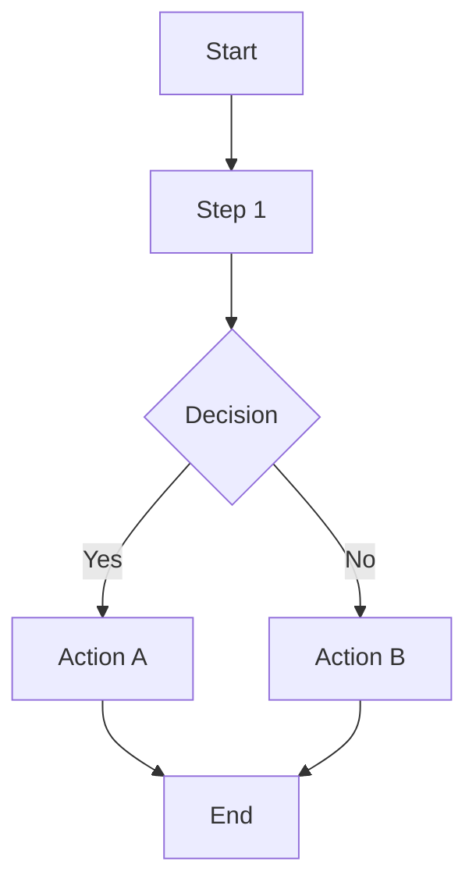

# Feature Spec: {{FEATURE_NAME}}

> **版本**: 1.0
> **创建日期**: {{DATE}}
| **作者**: {{AUTHOR}}
> **状态**: Draft | Review | Approved | In Progress | Completed

## Overview

<!-- 功能概述 -->

### Problem Statement

<!-- 描述要解决的问题 -->

### Proposed Solution

<!-- 描述解决方案 -->

## User Stories

### Story 1: {{USER_ROLE}}

```
As a {{USER_ROLE}},
I want to {{DESIRED_ACTION}},
So that {{BENEFIT}}.
```

**Priority**: High | Medium | Low
**Estimate**: {{STORY_POINTS}}

#### Acceptance Criteria

- [ ] {{CRITERION_1}}
- [ ] {{CRITERION_2}}
- [ ] {{CRITERION_3}}

## Requirements

### Functional Requirements

| ID | Requirement | Priority | Status |
|----|-------------|----------|--------|
| FR-001 | {{REQUIREMENT_DESCRIPTION}} | Must/Should/Could | - |

### Non-Functional Requirements

| Category | Requirement | Metric |
|----------|-------------|--------|
| Performance | {{REQUIREMENT}} | {{METRIC}} |
| Security | {{REQUIREMENT}} | {{METRIC}} |
| Scalability | {{REQUIREMENT}} | {{METRIC}} |
| Reliability | {{REQUIREMENT}} | {{METRIC}} |

## Scope

### In Scope

- {{SCOPE_ITEM_1}}
- {{SCOPE_ITEM_2}}
- {{SCOPE_ITEM_3}}

### Out of Scope

- {{OUT_OF_SCOPE_ITEM_1}} (Reason: {{REASON}})
- {{OUT_OF_SCOPE_ITEM_2}} (Reason: {{REASON}})

## User Flow



### Step by Step

1. **步骤名称**: {{DESCRIPTION}}
   - 触发条件: {{TRIGGER}}
   - 用户操作: {{ACTION}}
   - 系统响应: {{RESPONSE}}

2. **步骤名称**: {{DESCRIPTION}}
   - 触发条件: {{TRIGGER}}
   - 用户操作: {{ACTION}}
   - 系统响应: {{RESPONSE}}

## UI/UX Requirements

### Screens

| Screen | Description | Mockup Link |
|--------|-------------|-------------|
| {{SCREEN_NAME}} | {{DESCRIPTION}} | {{LINK}} |

### Interactions

| Element | Interaction | Behavior |
|---------|-------------|----------|
| {{UI_ELEMENT}} | {{INTERACTION}} | {{BEHAVIOR}} |

## Data Model

### Entities

```mermaid
erDiagram
    {{ENTITY_A}} {
        {{TYPE}} {{FIELD_NAME}}
        {{TYPE}} {{FIELD_NAME}}
    }
    {{ENTITY_B}} {
        {{TYPE}} {{FIELD_NAME}}
        {{TYPE}} {{FIELD_NAME}}
    }
    {{ENTITY_A}} ||--o{ {{ENTITY_B}} : "relationship"
```

### Data Fields

| Field | Type | Required | Constraints | Description |
|-------|------|----------|-------------|-------------|
| {{FIELD_NAME}} | {{TYPE}} | Yes/No | {{CONSTRAINTS}} | {{DESCRIPTION}} |

## API Requirements

### Endpoints

| Method | Endpoint | Description | Auth Required |
|--------|----------|-------------|---------------|
| {{METHOD}} | {{PATH}} | {{DESCRIPTION}} | Yes/No |

> 详细 API 规范请参考: `{{API_SPEC_LINK}}`

## Dependencies

| Dependency | Type | Status | Notes |
|------------|------|--------|-------|
| {{DEPENDENCY_NAME}} | Internal/External | - | {{NOTES}} |

## Implementation Plan

### Phases

#### Phase 1: {{PHASE_NAME}}

**Goal**: {{PHASE_GOAL}}

| Task | Estimate | Owner | Status |
|------|----------|-------|--------|
| {{TASK_NAME}} | {{ESTIMATE}} | {{OWNER}} | - |

#### Phase 2: {{PHASE_NAME}}

**Goal**: {{PHASE_GOAL}}

| Task | Estimate | Owner | Status |
|------|----------|-------|--------|
| {{TASK_NAME}} | {{ESTIMATE}} | {{OWNER}} | - |

## Testing Strategy

### Test Types

- [ ] Unit Tests
- [ ] Integration Tests
- [ ] E2E Tests
- [ ] Performance Tests
- [ ] Security Tests

### Test Cases

| ID | Scenario | Expected Result | Status |
|----|----------|-----------------|--------|
| TC-001 | {{SCENARIO}} | {{EXPECTED}} | - |

## Risks & Mitigations

| Risk | Probability | Impact | Mitigation Strategy |
|------|-------------|--------|---------------------|
| {{RISK_DESCRIPTION}} | High/Medium/Low | High/Medium/Low | {{MITIGATION}} |

## Success Metrics

| Metric | Target | How to Measure |
|--------|--------|----------------|
| {{METRIC_NAME}} | {{TARGET_VALUE}} | {{MEASUREMENT_METHOD}} |

## Rollout Plan

### Stages

1. **Alpha**: {{DESCRIPTION}} ({{DATES}})
2. **Beta**: {{DESCRIPTION}} ({{DATES}})
3. **GA**: {{DESCRIPTION}} ({{DATES}})

### Feature Flags

| Flag | Description | Default |
|------|-------------|---------|
| `{{FLAG_NAME}}` | {{DESCRIPTION}} | true/false |

## Monitoring & Alerting

### Metrics to Track

- {{METRIC_1}}
- {{METRIC_2}}
- {{METRIC_3}}

### Alert Conditions

| Condition | Severity | Action |
|-----------|----------|--------|
| {{ALERT_CONDITION}} | Critical/Warning | {{ACTION}} |

## Changelog

| Version | Date | Changes | Author |
|---------|------|---------|--------|
| 1.0 | {{DATE}} | Initial version | {{AUTHOR}} |
