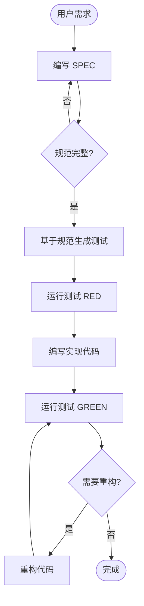

# Spec-Driven TDD Workflow

> **规格驱动测试驱动开发工作流**
> 结合规范驱动开发（SDD）和测试驱动开发（TDD）的最佳实践

## Overview

此工作流实现了 **SPEC 优先 + TDD 驱动** 的开发模式，确保在编写任何代码之前先明确规范，然后基于规范编写测试，最后实现功能。

## Flow Diagram



## Phases

### Phase 1: Specification（规范阶段）

**目标**: 创建完整、明确的功能规范

```
1. 用户描述需求
   ↓
2. 调用 spec-writer Agent
   ↓
3. 选择合适的规范模板
   ↓
4. 填写规范内容
   - 输入/输出定义
   - 业务规则
   - 边界条件
   - 错误处理
   ↓
5. 规范验证检查
   ↓
6. 保存到 .claude/specs/
```

**命令**:
```
/spec action=create type=function name=calculate_discount
```

**输出**:
- `.claude/specs/function/calculate_discount.md`

### Phase 2: Test Generation（测试生成阶段）

**目标**: 基于规范生成可执行的测试用例

```
1. 读取规范文件
   ↓
2. 解析业务规则和边界条件
   ↓
3. 生成测试用例
   - 正常场景测试
   - 边界条件测试
   - 错误处理测试
   ↓
4. 创建测试文件
   ↓
5. 验证测试覆盖
```

**命令**:
```
/spec action=generate-tests name=calculate_discount
```

**输出**:
- `tests/test_calculate_discount.py`

### Phase 3: Implementation（实现阶段）

**目标**: 编写满足规范和测试的实现代码

```
1. 运行测试（预期失败 RED）
   ↓
2. 编写最小实现代码
   ↓
3. 运行测试（预期通过 GREEN）
   ↓
4. 修复失败的测试
```

**TDD 循环**:
```
RED (测试失败) → GREEN (最小实现) → REFACTOR (重构优化)
```

### Phase 4: Refactoring（重构阶段）

**目标**: 在测试保护下优化代码质量

```
1. 代码审查
   ↓
2. 识别重构机会
   ↓
3. 执行重构
   ↓
4. 运行测试验证
   ↓
5. 提交代码
```

**命令**:
```
/refactor
/commit
```

## Commands & Agents Coordination

此工作流由 `orchestrator` 主控代理协调：

```
orchestrator
    ├── spec-writer (编写规范)
    ├── test-writer (生成测试)
    ├── debugger (调试失败)
    ├── code-reviewer (代码审查)
    ├── refactor-agent (重构优化)
    └── Skills
        ├── /spec
        ├── /test
        └── /commit
```

## Usage Examples

### 示例 1：完整功能开发

```
User: "实现用户折扣计算功能"

Claude:
1️⃣ 规范阶段
   → 调用 spec-writer
   → 创建 function spec

2️⃣ 测试阶段
   → 调用 test-writer
   → 生成测试用例
   → 运行测试 (RED)

3️⃣ 实现阶段
   → 编写实现代码
   → 运行测试 (GREEN)

4️⃣ 重构阶段
   → 代码审查
   → 重构优化
   → 提交代码
```

### 示例 2：API 开发

```
User: "实现用户列表 API"

Claude:
1️⃣ 创建 API 规范
   /spec action=create type=api name=users_list

2️⃣ 生成 API 测试
   /spec action=generate-tests name=users_list

3️⃣ 实现 API 端点
   [编写实现代码]

4️⃣ 运行测试验证
   /test
```

## File Structure

```
project/
├── .claude/
│   ├── specs/
│   │   ├── function/
│   │   │   └── calculate_discount.md
│   │   ├── api/
│   │   │   └── users_list.md
│   │   └── feature/
│   │       └── user_authentication.md
│   ├── templates/
│   │   └── specs/
│   │       ├── function-spec.md
│   │       ├── api-spec.md
│   │       └── feature-spec.md
│   └── workflows/
│       └── spec-driven-tdd.md
├── tests/
│   ├── test_calculate_discount.py
│   └── test_users_list.py
└── src/
    ├── discount.py
    └── api/
        └── users.py
```

## Best Practices

### 规范编写

- ✅ **明确性**: 使用精确的语言描述需求
- ✅ **完整性**: 考虑所有边界条件和错误场景
- ✅ **可测试性**: 每个规则都应可被测试验证
- ❌ 避免模糊的描述
- ❌ 避免遗漏边界条件

### 测试编写

- ✅ **覆盖率**: 测试应覆盖所有业务规则
- ✅ **独立性**: 每个测试应独立运行
- ✅ **可读性**: 测试名称应清楚描述测试内容
- ❌ 避免测试之间的依赖
- ❌ 避免过度复杂的测试逻辑

### 实现编码

- ✅ **最小实现**: 只实现满足规范的最小代码
- ✅ **及时重构**: 保持代码简洁和可维护
- ❌ 避免过度设计
- ❌ 避免添加规范之外的功能

## Integration with Spec-Kit

如果项目安装了 [Spec-Kit](https://github.com/github/spec-kit)，此工作流可以：

1. 使用 Spec-Kit 的规范格式
2. 调用 `specify` 命令初始化项目
3. 生成与 Spec-Kit 兼容的规范文件

### Spec-Kit Commands

```bash
# 初始化 Spec-Kit 项目
specify init

# 创建新规范
specify create

# 生成实现
specify implement
```

## Checklist

### 开始开发前

- [ ] 需求已明确
- [ ] 技术栈已确定
- [ ] 测试框架已配置

### 规范阶段

- [ ] 规范模板已选择
- [ ] 输入/输出已定义
- [ ] 业务规则已列出
- [ ] 边界条件已考虑
- [ ] 错误处理已定义

### 测试阶段

- [ ] 测试用例已生成
- [ ] 测试覆盖所有场景
- [ ] 测试可以独立运行
- [ ] 初始测试运行失败 (RED)

### 实现阶段

- [ ] 最小实现已编写
- [ ] 所有测试通过 (GREEN)
- [ ] 代码符合规范

### 重构阶段

- [ ] 代码已审查
- [ ] 重构已完成
- [ ] 测试仍然通过
- [ ] 代码已提交

## Troubleshooting

### 问题: 规范不完整

**症状**: 测试编写时发现规范缺少必要信息

**解决**:
1. 回到规范阶段
2. 补充缺失的信息
3. 重新生成测试

### 问题: 测试无法覆盖所有场景

**症状**: 实现代码中发现规范未考虑的场景

**解决**:
1. 更新规范
2. 添加新的测试用例
3. 更新实现代码

### 问题: 测试一直失败

**症状**: 无法通过所有测试

**解决**:
1. 使用 debugger Agent 诊断问题
2. 检查实现是否符合规范
3. 检查测试是否正确

## Related Resources

- [.claude/commands/spec.md](../commands/spec.md) - /spec 命令
- [.claude/agents/spec-writer.md](../agents/spec-writer.md) - spec-writer Agent
- [.claude/templates/specs/](../templates/specs/) - 规范模板
- [.claude/docs/spec-kit-guide.md](../docs/spec-kit-guide.md) - Spec-Kit 指南
